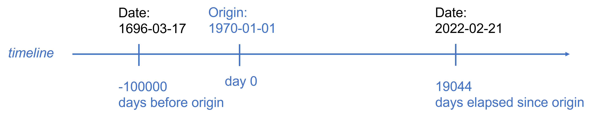

# Working with variables

```{r 2-setup, include = FALSE, eval = TRUE}

rm(list = ls()[-which(ls() %in% c("ah", "demo", "treatment"))])

knitr::opts_chunk$set(eval = TRUE, echo = TRUE, 
                      message = FALSE,
                      warning = FALSE,
                      error = TRUE,
                      fig.align = 'center')

```

In virtually all studies, the data preparation process involves computing new variables or modifying some of the existing ones. The operations needed to modify an existing variable, or to create a new one, are typically dependent on the type of the input variable(s). For instance, numerical variables (such as the body weight and height) may be used to compute another numeric variable (the body mass index) with some formula; factors (such as the study site in multicentric studies) are often used to create a new variable (such as region or country) using some classification algorithm; and character variables (like symptoms) may require homogenization tasks (such as capitalization or elimination of whitespaces). It is therefore important to know what are the tools available to work with different types of variables, and how to use them. In this chapter, we will see how to perform the most common operations on character vectors (or _strings_), factors and dates.  


## Strings

Strings of characters are almost always found among the data collected in a clinical study. The description of symptoms, signs, diseases, adverse events and treatments are examples of textual data. These kind of data is often encoded using controlled vocabularies, like [ICD-9](https://www.cdc.gov/nchs/icd/icd9.htm) or [ICD-10](https://www.cdc.gov/nchs/icd/icd10.htm) for diseases, [MedDRA](https://www.meddra.org/) for adverse events, or [ATC](https://www.whocc.no/) for drugs. However, proper encoding using these vocabularies is a non-trivial task that requires a very good knowledge of the coding vocabulary, and it is not always affordable or cost-effective, particularly in small studies. In addition, there is not always a controlled vocabulary available for the textual data at hand. For these reasons, working with strings is a common need in clinical and other type of studies. 

Although base R has functions to work with character vectors, we will give preference to those in package `stringr`, which is part of teh `tidyverse`. So, let's start by loading this package:

```{r 2-packages}
library(tidyverse)
```

\

### Whitespaces and capitalization

When working with real data, we will often find character vectors having semantically equivalent, but nonetheless _different_ elements, due to whitespaces and capitalization. Consider the following character vector:

```{r}
x <- c("Arterial hypertension", "arterial hypertension", "ARTERIAL HYPERTENSION",
       "arterial   hypertension ", "arterial hypertension ",  "Pneumonia", 
       "pneumonia", " pneumonia")
x
```

\

Although only two conditions appear in `x` (arterial hypertension and pneumonia), a frequency table of this vector will be less than satisfying, because all elements are actually different: some are lowercase, others contain uppercase letters, and some contain extra whitespaces (at the beginning, at the end, or between words):   

```{r}
data.frame(x) %>% count(x)
```

\

Because R is case sensitive, `"Arterial hypertension"` is not the same as `"arterial hypertension"`. In addition,  it is important to be aware that a white space (or _blank_) is a character in its own right, and therefore these two strings are different because of a trailing blank in the second one:

```{r}
"arterial hypertension" == "arterial hypertension "
```

\

Function `str_trim()` removes white spaces at the beginning or at the end of a string:

```{r}
str_trim(x) 
```

\

In the result above, elements two and four of `x` are still different, because the later has more than one white space between the two words. Function `str_squish()` not only removes leading and trailing white spaces, but also reduces repeated white spaces inside a string:  

```{r}
str_squish(x)
```

\

After getting rid of white spaces, we can use any of the following functions to homogenize case:  `str_to_lower()`, `str_to_upper()`, `str_to_title()` or `str_to_sentence()`. Here we use the last one (but you can try with the other three):

```{r}
x %>% 
  str_squish() %>%                  # removes leading, trailing and repeated blanks
  str_to_sentence()                 # capitalizes the first letter
  
```

\
The two conditions appearing in `x` have now a homogeneous spelling, so that a decent frequency table can be produced, as shown below. 

In the scripts above we started working with an isolated character vector (`x`) . But what if this is a variable in a dataframe? The same functions can be used (and chained!) within a mutate statement to compute a new version of `x`:

```{r}
d <- data.frame(x)
d

d %>% 
  mutate(x = x %>% 
           str_squish() %>% 
           str_to_sentence()) %>%  
  count(x)                                # frequency table of x values

```

\

Now the frequency table looks as it should.


### Matching, locating and replacing patterns

Sometimes we will need to match some defined _pattern_ in a character vector, with any of these purposes:

- _Detect_ which elements in the vector match the pattern.

- _Locate_ the position at which the pattern occurs in each element of the vector.

- _Replace_ the pattern with an alternative text.

- _Count_ how many times a pattern appears in each element of the vector.

Functions `str_detect()`, `str_locate()`, `str_replace()`, and `str_count()` serve these four purposes, respectively. In all three functions, a `pattern` argument has to be specified.

Consider the following vector describing the medical antecedents of 3 patients:

```{r}
x <- c("diabetes mellitus",  "asthma", "bronchial asthma + DM.")
x
```

\

Suppose we want to identify patients with bronchial asthma. Patients 2 and 3 have different descriptors, but both contain "asthma". Function `str_detect()` will tell us which elements in `x` contain "asthma", by returning a logical vector the same length of `x`, with `TRUE` when the `pattern` is detected or `FALSE` otherwise:  

```{r}
str_detect(x, pattern = "asthma")
```

\

In some cases we may need to know what are the _positions_ where a pattern is found. This can be achieved with function `str_locate()`. Note the result is a _matrix_ with as many rows as elements in `x`, and two columns indicating the `start`-ing and `end`-ing positions of the pattern (or `NA` for non-matching elements in `x`).

```{r}
str_locate(x, "asthma")
```

\

Now suppose we want to replace "DM" by the full description "diabetes mellitus". This can be done with `str_replace()`, specifying the `pattern` to be replaced and the `replacement` text:

```{r}
str_replace(x, pattern = "DM", replacement = "diabetes mellitus")
```

\

Last, `str_count()`counts the number of appearances of the `pattern` in each element of the input vector: 

```{r}
x <- c("I", "II", "III.", "IV")
str_count(x, pattern = "I")
```

\

The previous examples worked because the specified patterns contain letters only. However, when the pattern contains special characters, such as the dot, this will produce an error or unexpected results, as in this case:

```{r }
str_detect(x, pattern = ".")

```

\

The reason for the previous result is that, by default, `str_detect()` expects the pattern to be specified as a _regular expression_. Regular expression are introduced in the next section, but for the time being, a turnaround is to use the helper function `fixed()` to specify the pattern _literally_ (or `coll()` for languages other than English, see `?fixed`). Now the result is as expected:

```{r}
str_detect(x, pattern = fixed("."))           
```

\

### Regular expressions

Regular expressions (shortened as _regex_ or _regexp_) provide a very flexible and concise way to specify complex patterns in strings through the use of symbols with special meaning called _meta characters_. These are listed in table \@ref(tab:2-regex-meta-characters) and examples of use follow.

Meta character      Meaning
--------------      ------------------------------------------------------
.                   Matches any single character, except a line break 
|                   Matches the previous or the next characters
^                   Denotes the begining of the string
$                   Denotes the end of the string
[  ]                Matches any character contained between them
[^ ]                Matches any character NOT contained between them
(  )                Matches the characters contained between them in exact order
?                   Makes the preceeding optional
*                   Matches 0 or more repetitions of the preceeding 
+                   Matches 1 or more repetitions of the preceeding 
{n}                 Matches exactly n repetitions of the preceeding
{n,m}               Matches a minimum of "n" and a maximum of "m" repetitions of the preceding
\                   Escapes the next character
--------------      ------------------------------------------------------
: (\#tab:2-regex-meta-characters) Meta characters used in regular expressions

\


The period `.` is used as a _wildcard_. Here we use it to match not only `"diabetes"`, but also the misspelled `"diabetis"`:

```{r}
x <- c("diabetes mellitus", "diabetis", "DM", "non-diabetic", "carotid stenosis")
str_detect(x, pattern = "diabet.s")
```

\

The vertical bar `|` is used to specify alternative patterns (read it as _or_) to be matched. Here we use it to match "diabet.s" or the abbreviation for diabetes mellitus, "DM":

```{r}
str_detect(x, pattern = "diabet.s|DM")
```

\

The caret `^` and the dollar `$` are used as _anchors_, to indicate the begining and the end of the string, respectively. Here we use them to identify drug families (cephalosporins and monoclonal antibodies):

```{r}
x <- c("cefaclor", "cefixime", "diphenhydramine acefyllinate")
str_detect(x, pattern = "^cef")

x <- c("omalizumab", "reslizumab", "mabuterol")
str_detect(x, pattern = "mab$")

```

\

Square brackets `[]` are used to specify a _class_ of characters, so that _any_ character in the class will be matched. Classes can be specified by a sequence of characters, as in `[abc]`,  `[ABC]` or `[123]`, or using the dash to indicate a range, as in `[a-z]`, `[A-Z]`, or `[0-9]`. 

In the following example we use function `str_extract()` to get the doses and units from character vector `x`. The `+` is a _quantifier_, indicating to pick the pevious _one or more times_ (try without the `+` to see the difference):

```{r}
x <- c("250 mg", "500mg", "1 g", "1gram", "250 MG")
str_extract(x, pattern = "[0-9]+")           # any number
str_extract(x, pattern = "[a-zA-Z]+")        # any alphabetic character

```

\ 

Some classes of characters are so common that they are given special names:

```{r}
str_extract(x, pattern = "[:digit:]+")       # same as "[0-9]+"
str_extract(x, pattern = "[:alpha:]+")       # same as "[a-zA-Z]+"
```

\
 
When the caret `^` is used within `[]`, it means negation, that is, to match any character _not_ in the specified class. For instance, in the following script, we first extract roman numerals I to IV from vector `nyha`, and then we extract anything which is not one of them:

```{r}
nyha <- c("I. No limitation in normal physical activity", 
          "II. Mild symptoms only in normal activity", 
          "III. Marked symptoms during daily activities, asymptomatic only at rest", 
          "IV. Severe limitations, symptoms even at rest")

str_extract(nyha, pattern = "[IV]+")          # any I or V
str_extract(nyha, pattern = "[^IV]+")         # anything different from I and V

```

\

Brackets `()` are used to define a group of characters _in the specified sequence_. For instance, suppose we want to extract the units from vector `x`. Note the difference with square brackets:

```{r}
x
str_detect(x, pattern = "[mg]")        # match any m or g, lowercase
str_detect(x, pattern = "(mg)")        # match the sequence "mg"

```

\

The question mark `?` is used to make the preceeding optional. Here we use it to match two alternative spellings of some words:

```{r}
x <- c("haemorrhage", "hemorrhage", "hemoglobin decreased", "haemoglobin decreased")

str_detect(x, pattern = "ha?emo")

```

\
Braces `{}` are used to define number of repetitions, either exact, or in an interval:

```{r}

x <- c("AMI in 2019", "Born in 1989", "Pulse 75 bpm")
str_extract(x, pattern="[0-9]{4}")                   # exactly four digits

x <- c("500 mg/24h", "1000 mg/24h", "week 1: 750 mg daily")
str_extract(x, pattern="[0-9]{3,4}")                 # between three and four digits


```

\

The asterisk `*` allows to match any number of repetitions of an optional part: 

```{r}
x <- c("ab", "aab", "aaaab", "b", "c")
str_detect(x, pattern="a*b")

```

\

Last, the backslash (`\`) allows to remove the special meaning of meta characters, when we need to match them literally. However, because the backslash is a meta character itself, we need to remove its special meaning with another backslash, so that wee need to write two of them:

```{r}
x <- c("asthma", "astha + DM", "AHT + hyperlipidemia")
str_detect(x, "\\+")

```

\

Working with regular expressions is challenging, particularly as they increase in complexity, and a useful trick is to _visualize_ the matches they produce. A couple of functions help with this:  `str_view()` shows the first match, and `str_view_all()` shows all matches:

```{r}
x <- c("haemorrhage", "hemorrhage and hemoglobin decreased", "haemoglobin decreased")
str_view(x, pattern = "ha?emo")
str_view_all(x, pattern = "ha?emo")

```


### Subsetting strings

When we need to extract a specific part of a string defined by its position, function `str_sub()` is the way to go. Consider for instance the CIP codes, the unique personal identifier used by the Catalan Healthcare System, composed by 14 characters with the following structure:  "iiiisyymmddxxx", where "iiii" are surname initials, "s" is a code for sex (0: men, 1:female), "yymmdd" is the birth date, and "xxx" are three random numbers. 

Here we extract different parts of the CIP code based on `start` and `end` positions:

```{r}
x <- c("FEGA0720525000", "ROMA1680913000", "PEJI0590503")
str_sub(x, start = 5, end = 5)          # extracts sex code
str_sub(x, start = 6, end = 7)          # extracts year of birth
str_sub(x, start = 6, end = 11)         # extracts birthdate

```


### Other useful functions

Function `str_length()` finds the number of characters for each element of the input vector:

```{r}
x <- c("DM", "AHT")
str_length(x)
```

\

Sometimes we may want to collapse all the elements of a character vector into a single string (a character vector of length one). This can be done with `str_flatten()`:

```{r}
str_flatten(x, collapse = " and ")
```

\

With  `str_glue()` we can easily compose texts, inserting values as needed, which may be useful to produce narrative reports. Note the use of `str_flatten()` to define `antecedents`:

```{r}
pid <- 10
age <- 58
sex <- "male"
antecedents <- str_flatten(x, collapse = " and ")
adverse_event <- "cephalea"
study_day <- 3

str_glue("Patient number {pid}, a {age}y {sex} with {antecedents},
         reported {adverse_event} on study day {study_day}.")

```

\

Function `str_split()` splits up a string into pieces by defining a `pattern` used as separator, and returns a list the same length of the input vector. In the following example we split antecedents of a patient separated by a `+`. We need to use the (double) backslash in `pattern` to refer to literal `+`, and not to meta character `+`:   

```{r}
x <- c("asthma", "astha + DM", "DM + AHT + hyperlipidemia")
str_split(x, pattern = "\\+")

```

\

The result is a list of character vectors, each having as many elements as antecedents. We can use the option `simplify = TRUE` to get the result as a matrix instead, with as many rows as elements in the input vector, and as many columns as the maximum number of antecedents, three in this example. In this case, some entries will be empty for patients with less than three antecedents:

```{r}
str_split(x, pattern = "\\+", simplify = TRUE) 
```

\

Function `str_sort()` will sort the elements of a character vector alphabetically, unless we use option `numeric=TRUE`:

```{r}
x <- c("10 mg", "5 mg", "2.5 mg")
str_sort(x, numeric = TRUE)

```


## Factors

Package `forcats`, which is part of the `tidyverse`, has functions to address common needs when working with factors. To illustrate some of these functions we will use the DISETHAE data introduced in the previous chapter. Here we read the data and define a factor for the categorical variable `region`: 


```{r}

library(readxl)
ah <- read_excel("./data/hta.xlsx", sheet = "data") %>% 
  mutate(region = factor(region, 
                         levels = 1:17, 
                         labels = c("Andalucía", "Aragón", "Asturias",
                                    "Baleares", "Canarias", "Cantabria",
                                    "Castilla-La Mancha", "Castilla-León",
                                    "Catalunya", "Extremadura", "Galicia", 
                                    "La Rioja", "Madrid", "Murcia", "Navarra",
                                    "País Vasco", "Valencia")))

```

### Reordering levels

Suppose we want to produce a bar chart to see the number of patients recruited in each region. Here we use function `gf_barh()` from `ggformula` to produce a horizontal barchart:

```{r 2-region}
library(ggformula)
gf_barh(~region, data = ah)

```

\

We could make the bar chart more readable if regions were sorted by frequency. This is precisely the purpose of `fct_infreq()`:

```{r 2-region-sort}
gf_barh(~fct_infreq(region), data = ah, ylab = "Regions")
```

\

To sort them in descending frequency we can use `fct_rev()`, which reverses the order of the levels of a factor. Note how we pipe this function after `fct_infreq(region)`:

```{r 2-region-sort-reverse}
gf_barh(~fct_infreq(region) %>% fct_rev(), data = ah, ylab = "Regions")
```

\

Sometimes we may want to order the levels of a factor by some other variable. For instance, suppose we want to explore the mean age of patients in each region. To this end, we first group by region to compute the mean for each region, ungoup, and finally produce a graphic showing mean ages by region:

```{r 2-region-mage}
ah %>% 
  group_by(region) %>% 
  summarize(mean_age = mean(age)) %>% 
  ungroup() %>% 
  gf_point(region  ~ mean_age)
```

\

Again, this would be much more readable with regions sorted by the mean age. This can be done by passing variable `mean_age` as second argument to function `fct_reorder()`:


```{r 2-region-mage-sort}

ah %>% 
  group_by(region) %>% 
  summarize(mean_age = mean(age)) %>% 
  ungroup() %>% 
  gf_point(fct_reorder(region, mean_age) ~ mean_age, ylab = "Regions")

```


### Modifying levels

Changing the levels of a factor may be motivated by several reasons, such as providing better names, or grouping some levels into broader categories. There are several functions available in `forcats` to change the levels of a factor, some of which are very specialized. The most flexible one is `fct_recode()`. Here we use it to rename some of the regions according to official names. Note that new names are equated to old names (in this order), and that levels not mentioned will remain unchanged:

```{r 2-region-recode}
ah %>% 
  mutate(region = fct_recode(region,
                             "Principado de Asturias" = "Asturias",
                             "Comunidad Foral de Navarra" = "Navarra",
                             "Comunitat Valenciana" = "Valencia", 
                             "Castilla y León" = "Castilla-León",
                             "Cominudad de Madrid" = "Madrid")) %>% 
  gf_barh(~fct_infreq(region) %>% fct_rev(), ylab = "Regions")
```

\

If we need to group levels into broader categories, `str_collapse()` is useful, as shown in the script below. In the second argument to this function, each new (broader) level is equated to a vector of (old) levels. Again, note that levels not mentioned are kept unchanged ("Canarias" still appears in the plot since it is not classified in any of the new broader regions).

```{r 2-region-group, fig.height=2.5}
ah %>% 
  mutate(region = fct_collapse(region,
                             "North" = c("Galicia", "Asturias", "Cantabria", "País Vasco",
                                         "Navarra", "La Rioja", "Aragón"),
                             "East" = c("Catalunya", "Valencia", "Murcia"),
                             "South" =  "Andalucía", 
                             "Middle-West" = c("Castilla-La Mancha", "Castilla-León", 
                                               "Madrid", "Extremadura"))) %>% 
  gf_barh(~fct_infreq(region) %>% fct_rev(), 
          ylab = "Regions")

```

\

Sometimes we may need to collapse the levels of a factor which are less represented in the data. Suppose this is the distribution of the number of patients recruited in a clinical trial:

```{r 2-hosp, fig.height=3}
d <- data.frame(center = factor(paste("Hospital",rep(LETTERS[1:8], 
                             times = c(51, 26, 4, 5, 6, 32, 16, 6)))))

d %>% 
  gf_barh(~center %>% fct_rev(), ylab = "") 
```

\

In such a case, we may want to pool small centers before analysis to avoid a large imbalance of centers.  If none of its optional arguments is used, `fct_lump()` will pool smaller centers ensuring that the frequency of the pool will be lower than the remaining (unpooled) centers:

```{r 2-hosp-pool-1, fig.height=3}
d %>% 
  gf_barh(~fct_lump(center) %>% fct_infreq() %>% fct_rev(), ylab = "") 

```

\

Not very useful in this case, since the `Other` class only contains hospital C. However, we can controll how the pooling is done using one of the two optional arguments `n` or `prop`. With `n` we can state how many centers should be kept unpooled. With `prop` we can indicate that centers with a frequency lower than `prop` should be pooled: 

```{r 2-hosp-pool-2, fig.height=2}
d %>% 
  gf_barh(~fct_lump(center, n = 4) %>% fct_infreq() %>% fct_rev(), ylab = "") 

```


```{r 2-hosp-pool-3, fig.height=2}
d %>% 
  gf_percentsh(~fct_lump(center, prop = .15) %>% fct_infreq() %>% fct_rev(), ylab = "")
```

\

By default, the pool is named "Other", but the optional argument `other_level` allows to specify a different name:

```{r 2-hosp-pool-small, fig.height=2}

d %>% 
  gf_barh(~fct_lump(center, n = 4, other_level = "Small centers") %>% fct_rev(), ylab = "") 

```

### Ordered factors

A special type of factors are _ordered_ factors. The concept of an ordered factor may be a bit confusing, because the levels of a (regular) factor are always defined in a certain order, which affects how they are displayed in outputs like frequency tables or graphics. So, what is the point of _ordered_ factors? In fact, the most important reason is their use in statistical models, which is different for (regular) factors and ordered factors. 

Ordered factors can be defined with function `ordered()`, a variation of `factor()`. Consider the following example, where we create both a (regular) factor and an _ordered_ factor from a character vector of NYHA classes. You will note that, when printed to the console, the levels of `nyha_1` and `nyha_2` are displayed in a slightly different way (`Levels: I II III IV` and `Levels: I < II < III < IV`, respectively):

```{r}
nyha <- sample(c("I", "II", "III", "IV"), 10, replace = TRUE)

nyha_1 <- factor(nyha)                        # defines a (regular) factor   
nyha_2 <- ordered(nyha)                       # defines an ordered factor

nyha_1
nyha_2

```

\ 

In addition, the class of `nyha_2` is not just `"factor"`, but `"ordered"` as well:

```{r}
class(nyha_1)
class(nyha_2)

```

\

The behavior of both regular factors and ordered factors is the same in most cases. For instance, if we produce frequency tables or graphics, the result will be exactly the same:

```{r}
library(patchwork)
ggformula::gf_bar(~nyha_1) + ggformula::gf_bar(~nyha_2)
```

As commented above, the most important case where a regular or an ordered factor makes a difference is statistical modeling. In any other instance, it is unlikely that you need to define an ordered factor. Although we will not discuss the use of ordered factors in statistical models here, we want to make you aware of their existence, just in case you come across them.


## Dates

R has several data structures (object classes) and functions to work with dates and date-time values, providing the functionality one may possibly need, even to deal with data from different [timezones](https://en.wikipedia.org/wiki/Time_zone). However, the `lubridate` package makes it easier to tackle many of the common tasks needed when processing date or date-time data in clinical studies. Because `lubridate` is not part of the `tidyverse`, we need to start by loading this package:

```{r}
library(lubridate)
```

\

### Data structures for date and date-time values

Let's start by looking at the difference between dates and dete-time values. While dates identify calendar days, date-time values identify a point in time (to the nearest second). A couple of functions in `lubridate` are useful to see the difference between dates and date-time values: `today()`, which returns today's date, and `now()`, which returns the current date-time:

```{r}
today()        # today's date, a date value
now()          # current time, a date-time value

```

\

Note that the date-time value produced by `now()` specifies a timezone: `CET` (standing for Central European Time). By default, this will be your computer's system timezone, but we can specify any timezone with argument `tz`, including `UTC` (corresponding to [Coordinated Universal Time](https://en.wikipedia.org/wiki/Coordinated_Universal_Time): 

```{r}
now(tz = "WET")                  # Western European Time (e.g., Canary Islands) 
now(tz = "Pacific/Auckland")     # City of New Zealand
now(tz = "UTC")                  # Coordinated Universal Time
```

\

Using `class()` we can see what are the types of objects used to store dates and date-times in R: 


```{r}
x <- today() 
y <- now() 
class(x)
class(y)
```

\

As you see, dates are stored in `Date` objects, while date-times are stored as `POSIXct` (or `POSIXt`) objects. As we saw in previous sections, date-time values can be converted to date objects with `as.Date()`:

```{r}
as.Date(y)                              # date-time to date
class(as.Date(y))
```

\

### Date and date-time formats 

By default, R uses the [ISO 8601 standard notation](https://en.wikipedia.org/wiki/ISO_8601) to specify dates and date-times. However, alternative notations can be used by means of _conversion specifications_. The following table shows the most common symbols used in conversion specifications (for a more complete list, see `?strptime`):

Symbol    Meaning
------    ------------------------
%a        abbreviated weekday name
%A        full weekday name
%d        day of the month 
%b        abbreviated month name
%B        full month name
%m        month as number
%y        year without century 
%Y        year with century
%H        hour 
%M        minute 
%S        second
%T        equivalent to %H:%M:%S
------    -------------------------
: (\#tab:2-strptime) Symbols commonly used in Date and time conversion specifications

\

These conversion specifications are used in a format string (e.g., `"%d %B %Y"`). Any other character included in the format string is interpreted literally. 

Function `format()` can be used to create a character string with the desired notation, as shown in these examples:

```{r}

format(x, format = "%A %d %B %Y") 
format(y, "%d-%b-%Y, %T %Z")

```

\

Similarly, we can read dates from character vectors expressing calendar dates in an specific notation, by specifying it in the `format` argument of `as.Date()`:

```{r}
as.Date("05/03/2001", format = "%d/%m/%Y")
```


<!-- While dates are extremely common in clinical studies, date-times are not, so that we will not pursue the discussion on how to work with them. Rather, we will concentrate on the needs that arise concerning dates.  -->


### Reading dates

Probably the most common problem with dates arises when reading data from external files in which calendar dates are indicated in strings using a specific notation (like "dd/mm/YYYY"). As we have seen in the previous section, these can be read and converted to `date` objects with `as.Date()`, provided the notation is consistent. However, inconsistent notation of dates is not uncommon, and cannot be handled by `as.Date()`. 

Fortunately, `lubridate` includes a family of functions that are able to parse dates from input vectors containing mixed date notations, provided the ordering of the date components is always the same. These functions are named according to the _order_ of the date components. For instance, the following strings contain highly heterogeneous date notations, but the components are always in the same order (day, month and year), so that we can use function `dmy()` to read them:


```{r}
x <- c("15-sep-03", "24/08/1987", "Tuesday 25 March 1958", "02121957")
dmy(x)

```

\

Similar functions are available for the remaining possible orderings: `dym()`, ymd()`, `ydm()`, `mdy()`, or `myd()`. For intance: 

```{r}
x <- c("2003, 15-sep", "1987 24/08", "1950, Tuesday 25 March", "19570212")
ydm(x)
```

\

Other functions of this family allow to parse incomplete dates, like year and month or year and quarter providing the date of the first day in the interval:

```{r}
partial <- c("2003-sep", "1987.08", "1950 March", "1957.2")      # year and month
ym(partial)

partial  <- c("2003-3", "1987.3", "1950 1", "1957.1")            # year and quarter
yq(partial)

```

\

Sometimes dates are split in diferent variables for the year, the month and the day. In such a case, a date  can be formed with function `make_date()`, whose arguments are pretty obvious. Note that arguments can be numeric, character, or mixed types:


```{r}

x1 <- "2001"
x2 <- 3
x3 <- 5

the_date <- make_date(year = x1, month = x2, day = x3)
the_date
class(the_date)

```


### Getting date components

When components have to be extracted from dates, functions with obvious names are available as shown in the following examples:

```{r}
bd <- ydm(x)              # a vector of birth dates
bd

year(bd)                  # get the year
month(bd)                 # get the month
day(bd)                   # get the day of month
wday(bd)                  # get the day of the week (1 to 7, starting on sunday)

```

\ 

In the case of months and days of the week, argument `label = TRUE` will provide their names instead of numbers, either abbraviated (default) or full (if argument `abbr`is set to `FALSE`). Nothe that in this case the result is a ordered factor:

```{r}

month(bd, label=TRUE)                    
wday(bd, label=TRUE, abbr=FALSE)      

month(bd, label=TRUE) %>% class()
wday(bd, label=TRUE, abbr=FALSE)  %>% class()

```

\

### A closer look to dates

Up to now we have seen how dates _look_ when printed to the console, but this is not what the _are_. In fact, dates are numeric vectors, as the following will reveal:

```{r}
x <- as.Date(c("2003-09-15", "1987-08-24", "1950-03-25", "1957-12-02"))
xx <- unclass(x)
xx
class(xx)
```

\

As you see, the actual contents is `r format(xx, scientific = FALSE)`, and this is the number of days elapsed since an arbitrary _origin_ (set to the first of January 1970). Thus, dates are stored as the number of days elapsed since the origin, as illustrated in figure \@ref(fig:dates_internal) (note that dates before the origin are stored as negative numbers). 

```{r dates_internal, echo = FALSE, fig.cap="Dates as stored in R"}

```

\

Package `lubridate` includes the date-time object `origin`, so that we can see what's the origin:

```{r}
as.Date(origin)
```

\ 

Now, we can easily verify that the values `r format(xx, scientific = FALSE)` stored in date `x` above are nothing but the numbers of days elapsed since the origin:

```{r}
x - as.Date(origin)
```

\
Or equivalently, we may add this number of days to the origin and we will get the dates in `x`.

```{r}
as.Date(origin) + xx
```

In summary, a `date` object is a numeric vector containing whole numbers (the number of days elapsed since the 1st Jan 1970), that have been given the _class_ atribute `Date`. He is a demo:

```{r}
x <- 1:7
x
class(x)
class(x) <- "Date"
x
```

### Shifting dates

Sometimes we may need to create a sequence of dates from a starting point in time. For instance, consider a study in which monthly visits are planned after enrollment of a patient. If we want to evaluate the difference between planned and actual visit dates, we need to create the sequence of planned dates to compare them to actual dates. 

If visit intervals are defined by a fixed number of days (say, 30 days) we just need to add this number to the enrollment date.  

```{r}
enrollment <- as.Date("2022-01-01")
enrollment
intervals <- 30 * 0:6
intervals
enrollment + intervals
```

\ 

Alternatively, we might prefer to set intervals as natural months, but this is not straightforward since the number of days in a month is not constant. Fortunately, `lubridate` has a family of functions that create natural _periods_ like months, weeks, or years. These functions take the name of the periods they create, and allow to indicate the number of periods want to create as a numeric vector: 

```{r}
enrollment + months(0:6)
enrollment + years(0:5)
```

\

If the addition of periods results in a non-existing date, these functions will return `NA`:

```{r}
enrollment <- as.Date("2001-01-31")
enrollment + months(0:6)
```

\ 

To avoid this, the operator `%m+%` should be used:

```{r}
enrollment %m+% months(0:6)
```

\ 

And similarly for leap years:

```{r}
leap_year(2020)
as.Date("2020-02-29") + years(0:5)
as.Date("2020-02-29") %m+% years(0:5)
```

### Intervals

Intervals are timespans bounded by start and end dates. Intervals can be created with function`interval()`, or with the operator `%--%`, from either `Date` objects or strings in ISO 8601 format:

```{r}
birth <- as.Date("2001-03-05")
interval(start = birth, end = today())       # from Dates
birth %--% today()                           # using %--%
"2001-03-05" %--% today()                    # from ISO 8601 strings
```

We can use intervals in several ways. For instance, we can use them to compute age at enrollment. To this end, we divide the interval between birth and enrollment dates by a period of one year. If we want to express age in completed years (as we usually do), we truncate the result :

```{r}
birth %--% today() / years(1)                   # age in years
trunc(birth %--% today() / years(1))            # age in complete years
```

\

Another interesting use of intervals is the detection of overlapping intervals. For instance, we may want to know if a concomitant medication was taken during a specific phase of a clinical trial. This can be done with function `int_overlaps()`, passing it the two intervals as arguments:

```{r}
treatment_phase <- interval("2021-01-01", "2021-03-31")
steroids <- interval("2020-12-15", "2020-12-31")
statins <- interval("2021-02-15", today())
int_overlaps(treatment_phase, steroids)
int_overlaps(treatment_phase, statins)
```

\

Last, intervals can be created also from a sequence of dates stored in a vector, with function `int_diff`()`. This will create intervals defined by two consecutive visits:

```{r}

visits <- enrollment %m+% months(0:6)
visits

int_diff(visits)
```

## Dataframe variables

In previous sections we have illustrated how to use of several functions to work with strings, factors and dates. To keep the examples code as simple as possible, we illustrated their use on vectors. However, when processing real data, it is very likely that we need to create new variables in a dataframe, which can be achieved with the `mutate()` function in `dplyr`. Any of the functions we have discussed can be used within a `mutate()` statement.

For instance, when reading the DISETAHE MS Excel file,  the two variables containing dates (`data_xtract_dt` and `ah_dx_dt`) are date-time objects in the resulting dataframe:

```{r}
library(readxl)
demo <- read_excel("./data/hta.xlsx", sheet = "data") %>% 
  select(pid, data_xtract_dt, region, age, sex, ah_dx_dt)

class(demo$data_xtract_dt)
class(demo$ah_dx_dt)
```

\

But when these variables are printed, we see that the time value non-informative (it is always `00:00:00`):

```{r}
head(demo)
```

\ 

To convert these variables to the simpler and more convenient `Date` class, the `as.Date()` function may be used in a `mutate()` statement:

```{r}
demo %>% 
  mutate(data_xtract_dt = as.Date(data_xtract_dt),
         ah_dx_dt = as.Date(ah_dx_dt))
```

\

While this is fine because we need to convert two variables only, it may be cumbersome when many variables have to be converted.


### Processing several variables at once

When several variables have to be processed the same way, a better approach is to use `across()` within `mutate()`. The `across()` function takes two arguments. This first argument indicates the variables to be processed, and the second argument specifies the function to be applied to these variables:

```{r}
demo %>% 
  mutate(across(c(data_xtract_dt, ah_dx_dt), as.Date))
```

\

In the first argument, helper functions can be used just like with `select()`:

```{r}
demo %>% 
  mutate(across(ends_with("dt"), as.Date))
```

\

If the function to be applied needs some arguments, they can be passed as further arguments to `across()`. For instance, suppose we want to define factors for all treatment variables in the DISETAHE study. Because all of them are coded the same way, the factor definition is identical for all:

```{r}
treatments <- read_excel("./data/hta.xlsx", sheet = "data") %>%
  select(pid, lmr:other) 

treatments %>% 
  mutate(lmr = factor(lmr, levels = 1:2, labels = c("yes", "no")),
         bb = factor(bb, levels = 1:2, labels = c("yes", "no")),
         diur = factor(diur, levels = 1:2, labels = c("yes", "no")),
         acei = factor(acei, levels = 1:2, labels = c("yes", "no")),
         arb = factor(arb, levels = 1:2, labels = c("yes", "no")),
         cbb = factor(cbb, levels = 1:2, labels = c("yes", "no")),
         ab = factor(ab, levels = 1:2, labels = c("yes", "no")),
         other = factor(other, levels = 1:2, labels = c("yes", "no")))

```

\

Using `across()`, we need to pass the `factor` function as second argument, and the `levels` and `labels` arguments as further arguments:

```{r}
treatments %>% 
  mutate(across(lmr:other, factor, levels = 1:2, labels = c("yes", "no")))

```

\

Sometimes we may want to identify the variables to be processed by their type. For instance, suppose that diagnostic variables had been defined as logical variables, as is the case in dataframe `diag` below:


```{r echo=FALSE}
diag <-  read_excel("./data/hta.xlsx", sheet = "data") %>%
  select(pid, age, sex,  starts_with("dx_")) %>% 
  mutate(across(contains("dx"), function (x) as.logical((x - 1)^2))) 

diag

```

Suppose we want to convert them to numeric with `as.numeric()`. This can be done using `where()` in the first argument of `across()` to identify all variables being of logical type, and `as.numeric` as the second argument:

```{r}
diag %>% 
  mutate(across(where(is.logical), as.numeric))
```

If the operation we need to perform is complex and there is no single function to do it, we can use an expression preceeded by `~`, and use `.x` to indicate where the variable in across is used. For example, supose we want to recode all drug treatments as 1 or 0 instead of 1 or 2 (for yes or no, respectively). This will work:

```{r}
treatments %>% 
  mutate(across(bb:other, ~ ifelse(.x == 1, 1, 0)))
```


## Resources {-}

- For more on strings and _regex_, look at the vignettes of the `stringr` package. You may see them by running the following code in the R console:
    + `vignette("stringr")`
    + `vignette("regular-expressions")`

- Of course, there is a [stringr R cheat sheet](https://evoldyn.gitlab.io/evomics-2018/ref-sheets/R_strings.pdf)!

- Try this nice [interactive tutorial](https://regexone.com/) to practice your _regex_. 

- For a comparison of `stringr` and base R functions, see [here](https://stringr.tidyverse.org/articles/from-base.html).

- Package [translateR](https://cran.r-project.org/web/packages/translateR/translateR.pdf)  provides easy access to the Google and Microsoft APIs for languaje detection and translation.

- If you are interested in fuzzy matching of strings, look at the [fuzzywuzzyR](https://cran.r-project.org/web/packages/fuzzywuzzyR/vignettes/functionality_of_fuzzywuzzyR_package.html) and [stringdist](https://github.com/markvanderloo/stringdist) packages.

- If you have ICD-9 or ICD-10 codes and need to compute comorbidity indices (such as the Charlson index), have a look to [package `icd`](https://jackwasey.github.io/icd/). 


- For more on  factors, look at the vignette of the `forcats` package by running the following code in the R console: `vignette("forcats")`, or see (this tutorial)[https://www.r-bloggers.com/2020/06/working-with-factors-in-r-tutorial-forcats-package/].

- For more on dates and times, see [this book chapter](https://r4ds.had.co.nz/dates-and-times.html), or [this comprehensive tutorial](https://www.r-bloggers.com/2020/04/a-comprehensive-introduction-to-handling-date-time-in-r/).


## Exercises {-}

1. From the following character vector of NYHA classes, use `str_extract()` with regular expressions to get two character vectors: one containing roman numerals only, and another one containing the text description, starting with a capital letter (the dots should be removed, as well any leading, trailing or extra white space).

    ```{r 2-exe-1}
    nyha <-  c("I. no limitation", 
               "II. mild symptoms ", 
               "III. Marked    symptoms", 
               "IV.  severe limitations")
    ```

    \

1. With the given vector on antecedents of four patients:

    ```{r 2-exe-2}
    antec <- c("Asthma", "DM and AHT", "DM, AHT and pneumonia", "AHT + pneumonia")

    ```

    + Use `str_view_all()` to test a regular expression detecting all separators between different antecedents of the same patient(`and`, `,` or `+`).
    + Use `str_replace_all()` to homogenize separators between antecedents using always `+` (e.g., "DM + AHT + pneumonia").
    + From the vector you got in the previous question, can you compute a numeric vector showing the number of antecedents for each patient?

    \

1. Use the button to download a dataset on medical antecedents of 21 patients. After reading the data into dataframe `d`, run the code below to detect all diabetic patients, and then address the following tasks.

    ```{r 2-antecedents-download, echo = FALSE}
    downloadthis::download_file(
      path = "./data/antecedents.xlsx",
      button_label = "Download antecedents data",
      button_type = "primary",
      has_icon = TRUE,
      icon = "fa fa-save",
      self_contained = FALSE)
    ```


    ```{r 2-exe-3-read-data, echo=FALSE}
    library(readxl)
    d <- read_excel("./data/antecedents.xlsx")
    ```

    \

    ```{r eval = FALSE}
    d$antecedent %>% 
      str_to_lower() %>% 
      str_view(pattern = "diabet.s|diabetic|dm")
    ```

    + Copy-paste the previous code and adapt the regexp in `pattern` to detect all patients with arterial hypertension.
    + Do the same to detect all patients with bronchial asthma.
    + Use the previous regexp patterns in `str_detect()` to create three new logical variables in dataframe `d`: `dm`, `aht`, and `ba`, as indicators of diabetes mellitus, arterial hypertension and bronchial asthma, respectively.

    \

1. Download the doses data set, read it, and produce the bar chart shown below.

    ```{r echo = FALSE}
    downloadthis::download_file(
      path = "./data/doses.xlsx",
      button_label = "Download doses data",
      button_type = "primary",
      has_icon = TRUE,
      icon = "fa fa-save",
      self_contained = FALSE)
    ```

    \

    ```{r 2-exe4, echo = FALSE, fig.height = 2}
    d <- readxl::read_excel("data/doses.xlsx") %>% 
      mutate(dose = as_factor(as.numeric(str_extract(dose, pattern = "[:digit:]+"))))
    ggformula::gf_barh(~dose, data = d)
    ```

    \

1. On the same data, use `fct_collapse()` to define doses as "low" (25 or 50 mg), "medium" (100 mg) or "high" (150 or 200 mg), and produce the following bar chart:

    ```{r 2-exe-5, echo = FALSE, fig.height = 1.5}
    d <- d %>% 
      mutate(dose = fct_collapse(dose,
                                 "low" = c("25", "50"),
                                 "medium" = "100",
                                 "high" = c("150", "200")))
    ggformula::gf_barh(~dose, data = d)
    ```

   \

1. The following code reads the DISETAHE study data, selects drug class variables, verticalises them, and filters patients that took each drug class. From the resulting dataframe `drug_classes`, reproduce the bar chart shown below (with identical descriptors for drug classes).

    ```{r}
    drug_classes <- readxl::read_excel("./data/hta.xlsx", sheet = "data") %>% 
      select(pid, bb:other) %>% 
      pivot_longer(bb:other, names_to = "drug_class", values_to = "value") %>% 
      filter(value == 1) %>% 
      arrange(pid, drug_class) 
    ```

    \

    ```{r 2-exe6, echo = FALSE, fig.height = 2}
    drug_classes %>% 
      mutate(treatment = factor(drug_class,
                                levels = c("bb", "diur", "acei", "arb", "cbb", 
                                           "ab", "other"),
                                labels = c("Beta blockers", "Diuretics", "ACEI", 
                                           "ARB", "CCB", "Alpha blockers", "Other")))  %>% 
      gf_barh(~ treatment %>% fct_infreq() %>% fct_rev(), ylab = "Drug class")
    ```

   \

1. Create a dataframe with the CIP codes provided below, and use a `mutate()` statement to compute additional variables `sex`, `dob` and `age`:
    + `cip` = the CIP code.
    + `sex` = a factor with labels "male" and "female".
    + `dob` = the date of birth; this should be a `Date` object.
    + `age` = the patient's age as of 2022-01-01.

    \    
    
    ```{r}
    cip <- c("FEGA0720525000", "ROMA1690913000", "PEJI0010503")
    ```

    \

    ```{r include = FALSE}
    
    data.frame(cip) %>% 
      mutate(sex = str_sub(cip, start = 5, end = 5) %>% 
               factor(levels = 0:1, labels = c("male", "female")),
             dob = str_sub(cip, start = 6, end = 11) %>% 
               ymd(),
             age = trunc(dob %--% as.Date("2022-01-01") / years(1))
             )
    ```

    \

1. Repeat the previous exercise after adding this new CIP to the `cip` vector: "ALCO0580325000".

    \

1. The date of enrollment of a patient in a study was "2016-01-01". In this study, follow-up visits should be conducted at 1, 3 and 6 months and 1 year after enrollment, and yearly thereafter up to 5 years. 

    + What should be the dates of follow-up visits assuming 30-day months?  
    + And what would they be using natural month intervals?  
    + Is there any saturday or sunday among them?

    \

1. Use `across()` in a `mutate()` statement to recode all yes/no variables in the DISETAHE dataset so that they take values 1 (for yes) or 0 (for no).

```{r include = FALSE}

readxl::read_excel("./data/hta.xlsx", sheet = "data") %>% 
  select(starts_with("dx_"), lmr:other) %>% 
  mutate(across(lmr:other, ~ifelse(.x == 2, 0, .x)))

```

